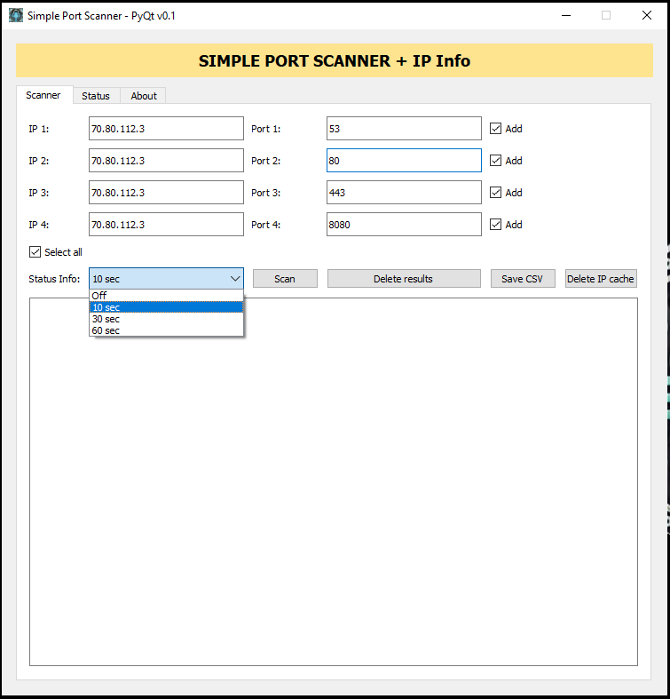
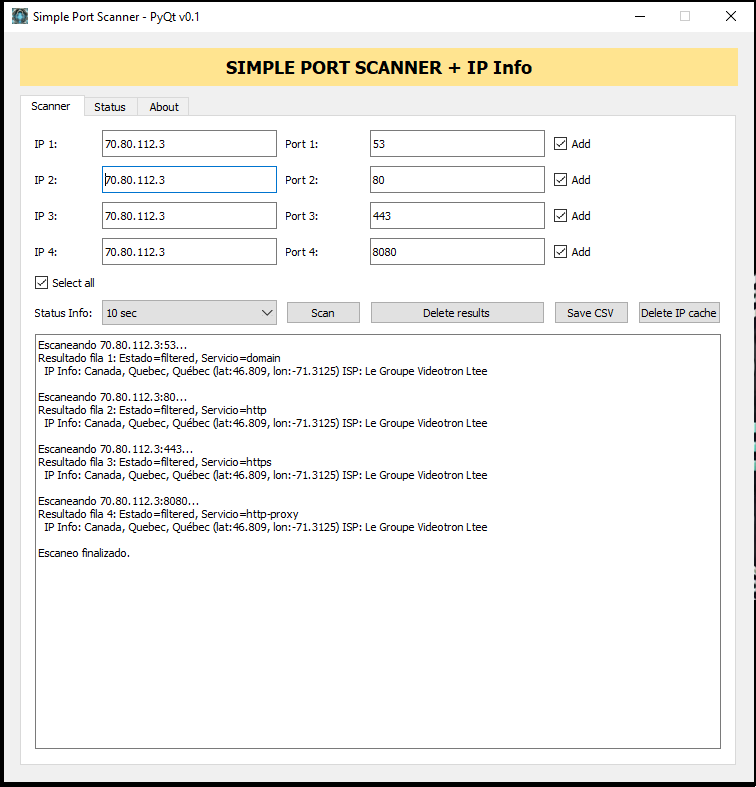

## Feel free to contact me through the following profiles:

 ## [Linkedin](https://www.linkedin.com/in/andrespds/) | [GitHub](https://github.com/tobproject) | [Instagram](https://www.instagram.com/tob_project/)


---

# Simple Port Scanner with GUI (PyQt5 / CustomTkinter)

This project consists of a simple TCP port scanner with a graphical interface in **two versions**:

- **scanner_PyQT.py** → version with PyQt5
- **scanner_CTK.py** → version with CustomTkinter

---

## 📌 Current Version: **v0.1 (Beta)**

Implemented Features:
- ✅ Individual port scanning in up to 4 rows.
- ✅ Checkbox to include/exclude rows from the scan.
- ✅ Use of `nmap` for status and service detection.
- ✅ Integration with `ip-api.com` to display country, region, city, coordinates, and ISP.
- ✅ Saving results to CSV with timestamp.
- ✅ Cleared IP cache and previous results.
- ✅ Separate tabs: **Scanner**, **Status**, and **About Developer**.
- ✅ Custom icon (`tobproject.ico`).

---

## 📷 Screenshots

> Place your screenshots in the repository under `assets/screenshots/` with the exact filenames below (or update the paths if you prefer a different folder). Recommended image size: **1200×800** (or a scaled PNG) — GitHub will auto-resize.

### PyQt version
<div align="center">

| PyQt — Scanner tab | PyQt — Status & About |
|---:|:---|
|  |  |
| *Figure 1 — PyQt: main scanner UI.* | *Figure 2 — PyQt: Status & About tabs (links open externally).* |

| PyQt — Scanner tab | PyQt — Status & About |
|---:|:---|
|  |  |
| *Figure 1 — PyQt: main scanner UI.* | *Figure 2 — PyQt: Status & About tabs (links open externally).* |

</div>

### CustomTkinter version
<div align="center">

| CTK — Scanner tab | CTK — Status & About |
|---:|:---|
|  |  |
| *Figure 3 — CTK: main scanner UI.* | *Figure 4 — CTK: Status & About tabs (link buttons).* |

</div>

**How to capture & add screenshots**
1. Run each script locally (`python scanner_PyQT.py` and `python scanner_CTK.py`).  
2. Arrange the window to show the elements you want (Scanner tab, Status tab, About tab).  
3. Capture the screen (Windows: `Win+Shift+S` or Snipping Tool; macOS: `Cmd+Shift+4`; Linux: `PrtScr` or `gnome-screenshot`) and save the file as the exact filenames below:
   - `assets/screenshots/pyqt_scanner_1.png`
   - `assets/screenshots/pyqt_status_about_2.png`
   - `assets/screenshots/ctk_scanner_1.png`
   - `assets/screenshots/ctk_status_about_2.png`
4. Commit & push the `assets/screenshots/` folder together with this `README.md`. GitHub will render the images inline.

---

## 📌 Visual Roadmap

| Feature | Status | Expected release |
|----------------------------------------|----------|------------------|
| Port scanning with Nmap | ✅ Done | v0.1 |
| Show IP info (geo, ISP) | ✅ Done | v0.1 |
| Save results to CSV | ✅ Done | v0.1 |
| Clear results and cache | ✅ Done | v0.1 |
| Custom icon in GUI | ✅ Done | v0.1 |
| `--stats-every` option (10s/30s/60s) | ✅ Done | v0.1 |
| "Open in Google Maps" button | 🚧 Pending | v0.2 |
| Save status log to TXT file | 🚧 Pending | v0.2 |
| Visual optimization for large outputs | 🚧 Pending | v0.2 |
| Code fixes and optimizations | 🚧 Pending | v0.2 |

---

## 🔧 Requirements

- Python 3.8+
- `nmap` installed on the system and accessible from `PATH`.

- Python Libraries:
  - `PyQt5` (for the PQT version)
  - `customtkinter` (for the CTK version)
  - `requests` or `urllib` (already included in the standard library)
  - `ipaddress`

Dependency Installation (example):
```bash
pip install pyqt5 customtkinter
