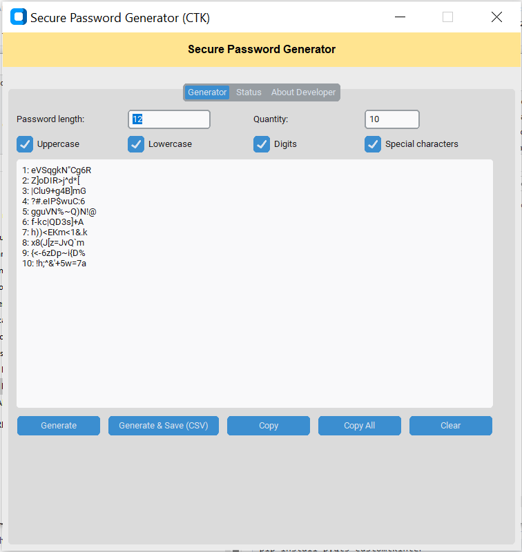
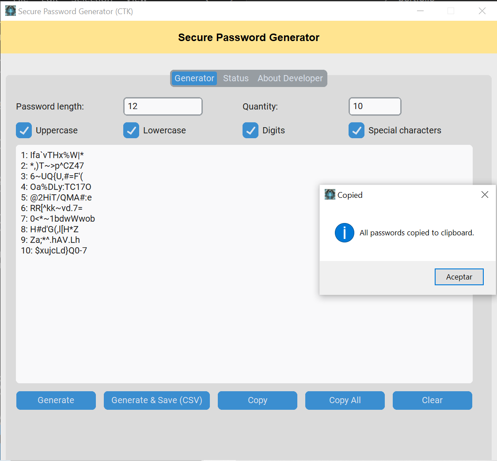

## Feel free to contact me through the following profiles:

## [Linkedin](https://www.linkedin.com/in/andrespds/) | [GitHub](https://github.com/tobproject) | [Instagram](https://www.instagram.com/tob_project/)

---

# Secure Random Password Generator with GUI (PyQt5 / CustomTkinter)

This project consists of a secure **random password generator** with a graphical interface in **two versions**:

- **PyQT_random_password_generator.py** → version with PyQt5
- **CTK_random_password_generator.py** → version with CustomTkinter

---

## 📌 Current Version: **v0.1 (Beta)**

Implemented Features:
- ✅ Generate secure passwords with configurable length (8–128 characters).
- ✅ Generate multiple passwords at once (1–500 passwords).
- ✅ Options to include/exclude uppercase, lowercase, digits, and special characters.
- ✅ Copy latest or all generated passwords to clipboard.
- ✅ Save generated passwords to a `.txt` file.
- ✅ Separate tabs: **Generator**, **Status**, and **About Developer**.
- ✅ Custom icon (`tobproject.ico`).

---

## 📷 Screenshots

### PyQt version
<div align="center">

| PyQt — Generator | PyQt — Status & About |
|---:|:---|
|  |  |
| *Figure 1 — PyQt: Generator UI* | *Figure 2 — PyQt: Status log & About tabs* |

</div>

### CustomTkinter version
<div align="center">

| CTK — Generator tab | CTK — Copied to clipboard pop-up |
|---:|:---|
|  |  |
| *Figure 3 — CTK: main generator UI.* | *Figure 4 — CTK: Copied to clipboard pop-up.* |

</div>

---

## 📌 Visual Roadmap

| Feature | Status | Expected release |
|----------------------------------------|----------|------------------|
| Generate passwords | ✅ Done | v0.1 |
| Multiple password generation | ✅ Done | v0.1 |
| Copy to clipboard | ✅ Done | v0.1 |
| Save passwords to TXT | ✅ Done | v0.1 |
| Configurable character sets | ✅ Done | v0.1 |
| Custom icon in GUI | ✅ Done | v0.1 |
| Status log tab | ✅ Done | v0.1 |
| Password strength indicator | 🚧 Pending | v0.2 |
| Visual optimization for large outputs | 🚧 Pending | v0.2 |
| Code fixes and optimizations | 🚧 Pending | v0.2 |

---

## 🔧 Requirements

- Python 3.8+
- Python Libraries:
  - `PyQt5` (for the PyQt version)
  - `customtkinter` (for the CTK version)
  - `secrets`, `string` (standard library)
  - `datetime` (standard library)
  - `webbrowser` (standard library)

Dependency Installation (example):
```bash
pip install pyqt5 customtkinter
```

---

## 📌 Usage

1. Run the desired GUI version:
```bash
python PyQT_random_password_generator.py
```
or
```bash
python CTK_random_password_generator.py
```

2. Configure:
   - Password length
   - Quantity of passwords
   - Character options (Uppercase, Lowercase, Digits, Special)

3. Click **Generate** to see results, **Generate & Save** to save to a file, or use **Copy** / **Copy All** buttons.

4. Check **Status** tab for timestamped generation log and **About Developer** for contact info.

---


